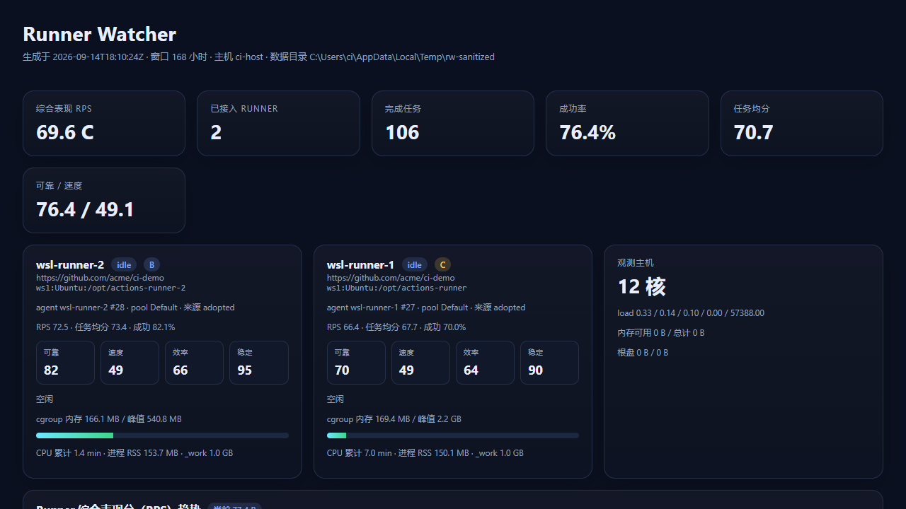

<div align="center">

# 🔭 dsh-runner-watcher · 自托管 Runner 观测镜

**给 [DeepSeek Harness](https://github.com/deepseek-ai) 装上 GitHub Actions self-hosted runner 的观测镜：runner 自己导入或让自动发现按身份关联，然后用 RPS 四维评分看清「这台 runner 到底跑得怎么样」，并在可交互的趋势图上追踪它的变化。**

[](https://github.com/topics/dsh-plugin)
[](https://www.npmjs.com/package/dsh-runner-watcher)
[](https://github.com/meyaomiao/dsh-runner-watcher/actions/workflows/ci.yml)
[](./LICENSE)


*零运行时依赖、无构建步骤：`lib/` 就是源码，64 项单测 + 端到端冒烟全绿才发版。*

**0.1.x** 首个公开版本：runner 注册表 + 身份关联 + RPS 评分 + 交互式看板。

</div>

## 🤝 合作伙伴：米云

<a href="https://momotoken.win"></a>

**[米云 MIYUN](https://momotoken.win)** —— 多模型 AI API 聚合平台：稳定不降智，模型上线快又多；统一 API 接入、按量使用、余额集中管理。

## ⭐ 欢迎点星收藏

如果 Runner Watcher 帮到了你，欢迎到 [GitHub 仓库](https://github.com/meyaomiao/dsh-runner-watcher) 点个 Star ⭐，让更多 DSH 用户看到它。问题与建议请提 Issue。

## 📋 兼容性

| 插件版本 | 状态 | 对应 DSH |
|---|---|---|
| **0.1.x**（当前主线） | ✅ | **0.1.5-rc.1 / 0.1.5-rc.2**（及之后的 0.1.5 线；用 `ctx.tools.register` + `webServer` 可选路由） |

Node **≥ 22.19**（CI 在 22 / 24 上跑）。

### 本次升级功能变化

首个公开版本，能力清单见下方「核心能力」。三个设计取向值得先说：

- **runner 是数据，不是路径**：注册表 + 身份关联，换目录不会多出一条。
- **难度不进评分**：`difficulty` 只描述活有多重；被派重活不该让 runner 背锅。
- **看板无副作用**：打开/刷新页面读落盘状态，不触发 runner 扫描。

## ✨ 截图速览

<p align="center">
  
</p>

趋势图支持**准星吸附**与**悬浮查看四维明细**；图例可切换综合 RPS / 可靠 / 速度 / 效率 / 稳定 / 当次任务分，还能单独打开每台 runner 自己的曲线。

## 🚀 核心能力

### 🧩 两种接入方式（与旧脚本最大的不同）

runner 是一份注册表，两种方式随你选，也可以混用。

**方式一 · 自己导入** —— 指哪打哪，给一个安装目录（含 `.runner` 的那一层）：

```bash
dsh-runner-watcher add --kind wsl   --distro Ubuntu --path /opt/actions-runner
dsh-runner-watcher add --kind local --path /opt/actions-runner
dsh-runner-watcher add --kind ssh   --host build-01 --user ci --path /home/ci/actions-runner
```

**方式二 · 自动发现 + 自动关联** —— 扫一遍主机，按身份接进注册表：

```bash
dsh-runner-watcher discover --transport wsl:Ubuntu           # 先看找到什么（落成 pending）
dsh-runner-watcher adopt                                     # 正式接入
dsh-runner-watcher discover --transport wsl:Ubuntu --adopt    # 或一步到位
dsh-runner-watcher discover                                   # 不指定：本机 + 所有 WSL 发行版 + 注册表已有主机
```

发现候选按可靠性排序：**systemd 单元**（自带 `WorkingDirectory`）→ **Windows 服务**（`PathName`）→ **约定路径扫描**。只有含可读 `.runner` 的目录才算候选。

### 🔗 关联是身份优先的

不靠路径去重，靠 GitHub 侧身份：

| 关联键 | 优先级 | 说明 |
|---|---|---|
| `agentId` | 最高 | GitHub 分配，重装、换目录后依然是同一台 |
| `githubUrl` + `agentName` | 次之 | 手工登记的条目通常只有这两个字段 |
| `transport` + 安装路径 | 兜底 | 连 `.runner` 都读不到时才会用到 |

因此：runner 换安装目录 → **更新**原条目；先按路径登记、后来读到 `.runner` → **原地升级**；主机这次没应答（WSL 没起、SSH 不通）→ 保留上次状态，**不误标 missing**；两个条目指向同一 agent → 明确报 `WARNING duplicate agent`，不悄悄合并。发现不到的已登记 runner 标 `missing`，但**条目与历史都保留**，下次扫到自动恢复。

### 📊 RPS 评分：回答「跑得好不好」

`difficulty` 只描述这次的活有多重，刻意不进任何评分。RPS（Runner Performance Score，0–100）是四维加权：

| 维度 | 权重 | 0–100 含义 |
|---|---|---|
| 可靠 reliability | 40% | 成功率。失败 0，取消/跳过 35，成功 100 |
| 速度 speed | 25% | 相对**同名任务**历史中位耗时。中位 = 50，快一倍 ≈ 90，慢一倍 ≈ 10 |
| 效率 efficiency | 20% | 子进程忙碌比 + 相对速度 + 成功奖励 |
| 稳定 stability | 15% | 日志错误行、失败步骤、非 0 退出码越少越高 |

等级 **S** ≥90 / **A** ≥80 / **B** ≥70 / **C** ≥60 / **D** ≥50 / **F** <50。单次任务另有 `job_score`（权重 35/25/20/20）。缺维度时权重自动重新归一化，所以 worker 日志被轮转也能评分，只是证据更少。

> **为什么速度用「相对同名任务中位」而不是绝对秒数**：`Verify and package` 天然要几分钟，`Detect deploy targets` 只要十几秒。用绝对耗时会得出「谁跑得快谁就好」的错误结论；换成同名中位比值后，**同一工作流在不同 runner 上的表现才可比**。

### 📈 趋势图 = 滚动 RPS

横轴是任务完成时间，每个点 = 最近 N 次任务（默认 6）的综合分。所以曲线回答的是「最近这段时间这台 runner 表现如何」，而不是把三个不同量纲的指标硬叠在一张图上的伪趋势。

### 🔍 采集范围

| 传输 | 实时指标来源 | 任务来源 |
|---|---|---|
| `local` | 进程 + 目录体积 | `<dir>/_diag` |
| `wsl` | `systemctl show`（cgroup 内存/峰值/CPU/重启）+ `ps` | `<dir>/_diag` |
| `ssh` | 同上（远端 POSIX 命令） | `<dir>/_diag` |

采集按**整段路径**匹配进程——`/opt/actions-runner` 不会认领 `/opt/actions-runner-2` 的进程与 cgroup 内存。某台 runner 失败只记一条 `error`，不中断整轮。

### 🛠 DSH 工具

| 工具 | 作用 |
|---|---|
| `runner_watcher_status` | 实时状态：state、cgroup 内存/CPU、进程、`_work`、当前任务 |
| `runner_watcher_list` | 注册表：已登记 runner + 待确认候选 |
| `runner_watcher_add` | 手工导入一台 |
| `runner_watcher_remove` | 移出注册表（保留历史任务） |
| `runner_watcher_discover` | 扫描主机并按身份关联 |
| `runner_watcher_adopt` | 把 pending 候选正式接入 |
| `runner_watcher_collect` | 采集 + 入库 + 出分析 |
| `runner_watcher_analyze` | 只分析已存历史 |
| `runner_watcher_dashboard` | 渲染 HTML 看板并返回路径 |

Web 端在 `/dsh-runner-watcher` 提供看板，另有 JSON 接口 `api/status` / `api/analyze` / `api/registry` / `api/jobs`。`webServer` 是**可选**依赖：headless profile 里插件照常装载并注册工具，只是不挂路由。

## 📦 安装

```bash
# 方式〇:npm 安装(推荐)
dsh plugin --profile web add dsh-runner-watcher

# 方式一:从 GitHub 直接装(dsh CLI,免 npm)
dsh plugin --profile web add github:meyaomiao/dsh-runner-watcher

# 方式二:克隆后本地挂载(零依赖,无需 install/build)
git clone https://github.com/meyaomiao/dsh-runner-watcher.git
cd dsh-runner-watcher && node scripts/smoke.mjs
dsh plugin --profile web add .
```

插件自带的 `cordis.patch.yml` 会把自己 insert 进插件树，**不需要手工改 patch**。安装后重启 `dsh web` 并硬刷新（Ctrl+F5），看板在 <http://127.0.0.1:3080/dsh-runner-watcher>。

装完先接一台 runner：

```bash
dsh-runner-watcher discover --adopt     # 或 add --kind ... --path ...
dsh-runner-watcher collect              # 采集 + 入库 + 出分析
dsh-runner-watcher dashboard --open
```

### 💻 独立 CLI

不装 DSH 也能用（cron、排障、首次试用）：

```bash
dsh-runner-watcher status                    # 实时状态
dsh-runner-watcher list                      # 注册表
dsh-runner-watcher analyze --hours 48 --json
dsh-runner-watcher dashboard --refresh 15 --open
dsh-runner-watcher serve --port 8790         # 只读看板
```

## 🗂 数据目录

默认 `<dsh home>/runner-watcher`（可用 `--data-dir` / `DSH_RUNNER_WATCHER_DIR` / 插件配置覆盖）。

| 文件 | 含义 |
|---|---|
| `runners.json` | 注册表：已登记 runner + pending 候选 |
| `jobs.jsonl` | 去重后的任务记录（含四维与难度） |
| `snapshots.jsonl` | 每次 collect 的资源快照（时间序列，只追加） |
| `last_state.json` | 最近一次完整状态（看板直接读它，翻页不触发采集） |
| `dashboard.html` | 生成的看板 |

## ⚙️ 配置

`cordis.patch.yml` 里的 `config:` 全部可选：

| 键 | 默认 | 含义 |
|---|---|---|
| `dataDir` | `<dsh home>/runner-watcher` | 状态目录 |
| `autoDiscover` | `true` | collect 前是否先扫一遍 |
| `autoAdopt` | `false` | 发现即接入，还是先落 pending |
| `windowHours` | `168` | 分析窗口 |
| `rollingWindow` | `6` | 一个 RPS 点覆盖多少次任务 |
| `refreshSeconds` | `0` | 看板自动刷新间隔，0 关闭 |

## 🔐 隐私

**只读** `.runner`、`_diag`、进程与 systemd/cgroup 数据。**不读** `.credentials`、不碰 token、**不调用 GitHub API**（免配额、可离线），也不向任何远端发送数据——全部留在本地状态目录。

SSH 传输固定 `BatchMode=yes`：不接受密码提示，认证失败直接报错，不会挂住或静默降级。传进 shell 的路径一律单引号转义；脚本内容是代码里写死的固定字符串，不拼接用户提供的命令。

## 🛠 开发

```bash
node --test             # 64 项单测:解析 / 评分 / 注册表关联 / 存储 / 插件契约
node scripts/smoke.mjs  # 端到端:造一个合成 runner 安装目录,走完 导入→去重→发现→关联→采集→幂等复采→分析→出图
node lib/cli.js --help  # CLI 自检
```

零运行时依赖、无构建步骤，`lib/` 就是源码：

```
lib/
  index.js            DSH 插件入口（工具 + 可选 web 路由）
  cli.js              独立命令行
  core/
    paths.js          状态目录解析
    transport.js      local / wsl / ssh 三种传输
    registry.js       注册表 + 身份关联（项目的心脏）
    discover.js       自动发现 + .runner 解析
    parse.js          Listener / Worker 日志解析
    score.js          RPS 评分模型
    store.js          JSONL 任务库（键去重）
    collect.js        快照采集
    analyze.js        聚合分析
    report.js         看板渲染
  dashboard.html.tpl  无框架的看板模板（canvas 交互图）
```

改仓库前先读 [CONTRIBUTING.md](./CONTRIBUTING.md)。设计与取舍见 [docs/design.md](./docs/design.md)，评分细节见 [docs/scoring.md](./docs/scoring.md)，接入说明见 [docs/runners.md](./docs/runners.md)。

## License

[MIT](./LICENSE) © meyaomiao
